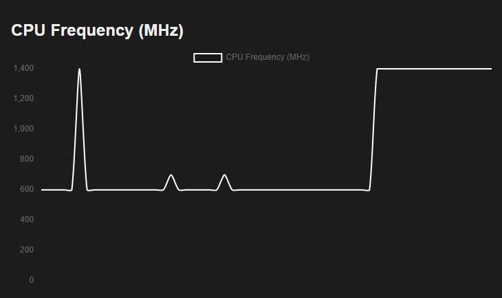

# Perfy
Tools to collect performance metrics and display them through a web GUI, while being able to launch
benchmarks from webgui.

(CPU Utilization Plot from dashboard)

(CPU Core Frequency from dashboard)

## Running Dashboard
1. Create python (v3.10 and above) virtual environment after cloning directory. Run `python3 -m
venv venv` inside `Perfy/` directory.
2. Get python dependencies by running `pip install -r requirements.txt`
3. `cd src/`
4. Source StartServer file: `. StartServer.sh`

## Running ALU Stress
1. `cd src/Stress`
2. `make`
3. `./stress`
4. `make clean` to remove binaries and object files

### 11/16/2025: Initial Architecture & Planning
#### Steps
1. [x] Get Python Webserver up
2. [x] Collect perf metrics
3. [x] Aggregate metrics
4. [x] Display Raw Data
5. [x] Implement dashboard
6. [x] ALU Stress
7. [x] Multi-thread ALU Stress
8. [ ] ALU + Mem Stress

Note when running inside WSL & VMs, some MSRs may be masked or not visible, resulting in incorrect
readings for metrics like CPU Core Frequency.

### 11/12/2025: Adding Stress
Got initial ALU stress working then added threading, using POSIX-threads. Can see a cool step up
in CPU utilization on dashboard component when running the stress.

